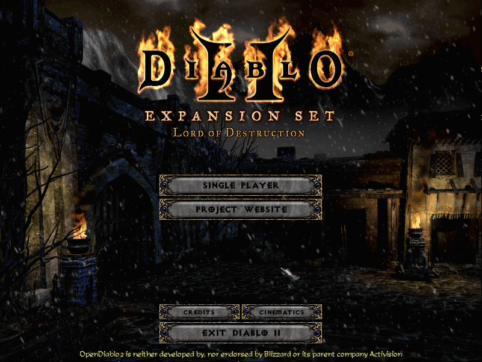

# OpenDiablo2 

[Join us on Discord!](https://discord.gg/pRy8tdc)\
[Development Live stream](https://www.twitch.tv/essial/)

## About this project

OpenDiablo2 is an ARPG game engine in the same vein of the 2000's games, and supports playing Diablo 2. The engine is written in golang and is cross platform. However, please note that this project does not ship with the assets or content required to play Diablo 2. You must have a legally purchased copy of [Diablo 2](https://us.shop.battle.net/en-us/product/diablo-ii) and its expansion [Lord of Destruction](https://us.shop.battle.net/en-us/product/diablo-ii-lord-of-destruction) installed on your computer in order to run that game on this engine. If you have an original copy of the disks, those files should work fine as well.

Currently we are working on features necessary to play Diablo 2 in its entireity, but will then expand with tools and plugin support to allow modding, as well as writing completely new games with the engine.

We are in the process of moving to a go based engine. We are taking good bits from the original C# base and migrating it over to the new engine code.

Please note that **this game is neither developed by, nor endorsed by Blizzard or its parent company Activision**.

Diablo 2 and its content is ©2000 Blizzard Entertainment, Inc. All rights reserved. Diablo and Blizzard Entertainment are trademarks or registered trademarks of Blizzard Entertainment, Inc. in the U.S. and/or other countries.

ALL OTHER TRADEMARKS ARE THE PROPERTY OF THEIR RESPECTIVE OWNERS.

## Building

To pull the project down, run `go get https://github.com/essial/OpenDiablo2`

On windows this folder will most likely be in `C:\\users\\(you)\\go\\src\\github.com\\essial\\OpenDiablo2`

In the root folder, run `go get -d` to pull down all dependencies.

To run the project, run `go run .` from the root folder.

You can also open the root folder in VSCode. Make sure you have the `ms-vscode.go` plugin installed.

## VS Code Extensions

The following extensions are recommended for working with this project:
 * ms-vscode.go
 * defaltd.go-coverage-viewer

You can get to it by going to settings <kbd>Ctrl+,</kbd>, expanding `Extensions` and selecting `Go configuration`,
then clicking on `Edit in settings.json`. Just paste that section where appropriate.

## Configuration

The engine is configured via the `config.json` file. By default, the configuration assumes that you have installed Diablo 2 and the
expansion via the official Blizzard Diablo2 installers using the default file paths. If you are not on Windows, or have installed
the game in a different location, the base path may have to be adjusted.

## Contributing
If you find something you'd like to fix thats obviously broken, create a branch, commit your code, and submit a pull request. If it's a new or missing feature you'd like to see, add an issue, and be descriptive! 
If you'd like to help out and are not quite sure how, you can look through any open issues and tasks.
